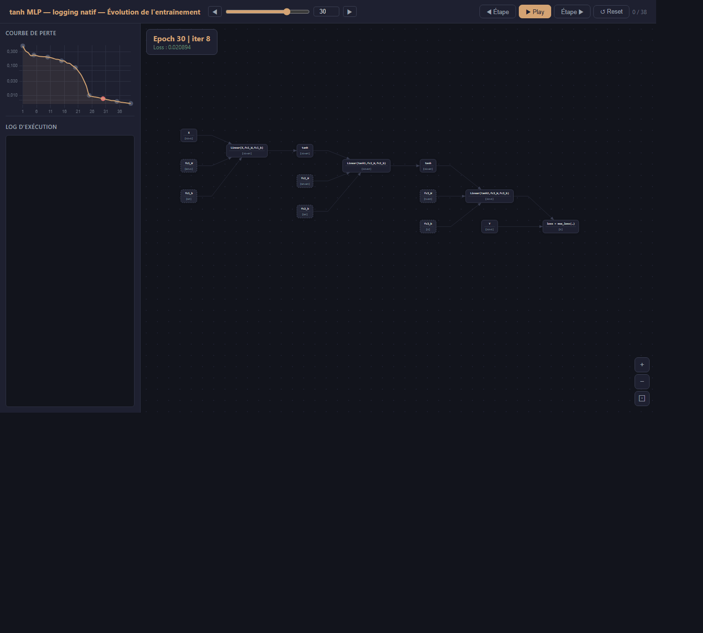
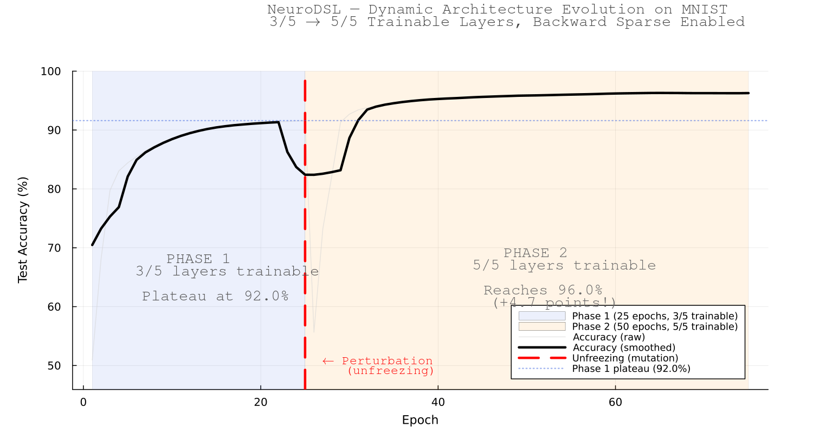

# NeuroDSL — A Reactive Computation Graph for Differentiable Programming

[](LICENSE)
[](https://julialang.org)
[](https://developer.nvidia.com/cuda-toolkit)
[](#citation)

**NeuroDSL** is a 100%-Julia framework built around one idea: a computation graph doesn't have to be a static trace you build once and run. In NeuroDSL, the graph is a **live, reactive object** — you can mutate a single node while training, insert or remove entire blocks mid-run, or patch an internal activation to test a causal hypothesis, and only the part of the graph that actually depends on that change gets recomputed. Nothing else moves.

That single property turns out to unlock three things a static-graph framework (PyTorch, JAX, most of Flux) can't do nearly as naturally: (1) growing a network's architecture mid-training, provably without changing the function it computes; (2) mechanistic-interpretability-style activation patching at a fraction of the usual recompute cost; and (3) inspecting any parameter's value *and* gradient interactively, live, without instrumenting your training loop by hand.

This README is deliberately not a hype sheet. Every claim below is backed by an experiment you can re-run yourself, a proof you can read in one of the linked preprints, or both — and the "what this isn't" section near the bottom is as important as the rest.

---

## See it in action



This is the built-in interactive viewer, generated by a single call to `save_interactive_graph_animated`. Every node is clickable — no logging code to write, no instrumentation to remember. Under the hood:

- **Green** traces the forward pass, **red** traces backward, live, node by node, in true execution order.
- Click any node to open a real, scrollable table of its actual values (and gradient, once backward has run) — not a summary, the real numbers.
- Click a specific weight inside that table to plot **its own value and its own gradient over every training iteration recorded**, side by side, updating as you step through the animation.

None of this requires a separate logging system layered on top of your script. `demand!` and `backward_graph!` log every node they touch on their own — it works on any graph built with NeuroDSL, not just this example.

---

## Growing a network mid-training, proven exact

Most frameworks make you choose your architecture before training starts. NeuroDSL lets you graft a new block into a live, already-trained graph — and proves, not just observes, that the network's function is unchanged at the instant of insertion.

`insert_block!` and `graft_shadow_block!` (`src/graph_surgery.jl`) insert a fresh residual block after any node. Under an identity-morphism theorem, zero-initializing the block's output projections makes the graft compute the exact identity — checked, not assumed: on a real model, all **1,600 logits before and after grafting are bit-identical (0 mismatches, max difference 0.0)**, at the level of raw binary representation. A second construction, *Gradient Shadowing* (a ReZero-style scalar gate over a randomly initialized branch), keeps that exactness while proving the new parameters receive a non-zero gradient at the very first post-graft optimizer step — and we identify, and show how to avoid, a degenerate configuration (zero gate *and* zero projections together) that is a genuine, inescapable fixed point of gradient descent, verified empirically at exact-zero resolution over 600 training steps.



The picture above is the informal version of the same idea (freeze/unfreeze mid-training on MNIST, optimizer state carried over untouched) — the formal version is the graft primitive above, with a real proof and a real bit-exactness check, not just an accuracy curve. Full derivation and experiments: **[Exact Network Surgery](<artilce/Exact Network Surgery Functional Invariance and Gradient.pdf>)** (preprint, see [Citation](#citation)).

---

## Why this is possible: O(|V_θ|), not O(graph size)

Every mutation above — a parameter update, a graft, an activation patch — works because NeuroDSL's invalidation is **local**. When you change a node θ, only the nodes reachable from it — its *impact subgraph* `V_θ` — get marked stale. The cost is proportional to `|V_θ|`, not to the size of the whole graph, and this is a proven theorem (structural locality, proved by double inclusion over the invalidation algorithm), not just a measured trend.

This is measured as a **node count**, not as a duration — deterministic, timer-free, and reproducible bit-for-bit on any machine. Inflate the graph sevenfold with subgraphs the edit cannot reach and the count does not move by a single unit:

| edited site | \|V\| = 601 | \|V\| = 1802 | \|V\| = 4204 |
|---|---|---|---|
| `:input` (negative control) | 493 | 493 | 493 |
| `layer_1_out` | 452 | 452 | 452 |
| `layer_6_out` | 247 | 247 | 247 |
| `layer_12_out` | **1** | **1** | **1** |

Two controls bracket the measurement from opposite sides. The negative one edits the graph input, where every invalidatable node is reachable and locality can save nothing — it saturates at 100%. The positive one makes the padding *reachable*, and the count then grows by exactly the predicted 600 nodes per unit while every deeper site stays bit-identical. A count that were constant by instrumentation error would pass the first and fail the second. Every point agrees with a BFS oracle written independently in the benchmark file, 16 of 16.

**Retrieval locality**, a second and previously unreported half: evaluation used to walk the cached topological order from its start, so its cost followed the target's *position in the whole graph* rather than what the target depends on. Restricting it to the target's real ancestor cone makes retrieval invariant in graph size too — and the two localities run in *opposite* directions along depth (invalidation is cheap at deep sites, retrieval at shallow targets), so between them they cover the graph. Note the honest condition: on a graph holding a single model the gain is exactly **1.00×**; it comes entirely from excluding subgraphs the target does not depend on.

Per-site cost varies over three orders of magnitude, which is the practically useful consequence: at GPT-2 scale a re-forward from `layer_12_mlp_out` takes 0.089 ms against a 23.04 ms full forward — **259×** — while the shallowest site is 1.04×. An *exhaustive uniform* sweep averages to a **2×** ceiling, which is a proven bound and not a number to headline; the payoff is in deep sites and in adaptive protocols where the recompute set changes as you go.

Reproduce all of it: [`docs/REPRODUCING.md` §1.1–1.3](docs/REPRODUCING.md).

---

## Incremental activation patching, at GPU scale

Activation patching — the core technique behind most mechanistic-interpretability work — mutates one internal activation and asks what changes downstream. In a tape-based framework that means a full forward pass per patch, always, regardless of where the patch sits. In NeuroDSL, a patch is exactly the local-invalidation mutation above: the cost scales with the affected cone, shrinking to near-zero for a patch near the output.

This is no longer a direction we're building toward — it's measured, at real scale:

- **A proven ceiling, not an empirical accident.** An exhaustive site-by-site sweep (patch every candidate, restore, move to the next) speeds up by at most **2×** over independent full recomputations on a depth-uniform network — and this is a theorem, with the exact rate for non-uniform cost profiles given in closed form (Karamata index `q`: `(q+2)/(q+1)` output-heavy, `q+2` input-heavy). See *Cost Accounting for Reactive Computational Graphs* (see [Citation](#citation); PDF export not yet in this repo, submitted to arXiv).
- **The aggregate is an average over a very wide spread.** At GPT-2 scale (12 layers, 12 heads, 156 sites) the deepest site re-forwards **259× cheaper** than a full forward and the shallowest only 1.04× — see `notebook/jalon0_results.json`. The closed-form cone size reproduces all 564 measured cones with zero residual. All correctness invariants (patched value survives `demand!`, restoration equals recomputation, independent patches commute) are re-verified at each scale rather than assumed to carry over.
- **`greedy_patch_search!` and `backward_prune!` find real circuits, not just cheap ones.** On an induction task with a documented causal circuit, automated search retrieves it directly, and backward pruning shows a handful of heads carry nearly all of the recovered effect — at GPU scale, on a real 1.82B-parameter model, not only on a CPU-sized toy.

Full derivation, the GPU-scale validation, and the induction-circuit experiments: **[Amortized Multi-Site Activation Patching via Cache-Replay Restoration in Persistent Computational Graphs](#citation)** (in preparation for peer review).

---

## Growing a network's depth: when it's worth it

A third line of work asks a training-economics question the graft primitive makes cheap to test empirically: does growing a network's depth mid-training ever beat training at full depth from scratch? Three theorems (a single-crossing lemma plus necessary/sufficient conditions) say it depends on which axis you fix — growing wins at equal **compute (FLOPs)**, loses at equal **step count** — and a closed-form capacity-floor model (derived from a digamma-function expansion) is validated, unrefit, against 18 independently measured growth schedules (`R² = 0.764`). Full derivation: **[Growing a Network During Training: The Economics of Depth](#citation)** (in preparation for peer review).

---

## What NeuroDSL is *not* (yet)

In the interest of not overselling this:

- **Do not train with it.** On an end-to-end character-level LM run at matched final validation loss, NeuroDSL is about **2.2× slower per step** than PyTorch (25.29 ms vs 11.35) and uses **25% more peak VRAM** on the training step (1.25×, or 1.09× with the opt-in `release_values=true`). Train elsewhere, load the weights, intervene here.
- **The memory profile is a trade, and it cuts both ways.** The graph keeps activations resident — which is exactly what makes the localities above possible, and exactly what makes training heavier. On forward-only episodes (validation, generation) that same design uses **30% less** peak VRAM than PyTorch (0.70×).
- **Fusion buys almost nothing in speed at realistic width.** It calls the vendor GEMM and applies the elementwise epilogue separately, so it saves a dispatch and a buffer, never a FLOP: +11.9% at dim 32, +2.2% at 128, −0.3% at 512 on CPU. Its output is bit-identical to the unfused composition at every configuration tested. Where it does pay is memory — 47.1% fewer resident activation nodes, which is 9.9% of total VRAM at dim 512.
- **"Optimal memory planning" is optimal but vacuous by default.** Interval colouring uses the minimum slot count for a fixed execution order, but a graph expecting a backward pass has no two disjoint activation lifetimes, so that minimum *is* the node count and no slot is ever shared (measured: 201 slots for 201 nodes). A forward-only plan does share — 201 → 40 — yet peak VRAM is unchanged, because the buffer pool retains what it reclaims. The mechanism that actually lowers the forward-only peak is eager release (`demand_release!`), at 2.77× better.
- **Frozen-prefix backward pruning is now measured, not just proven exact.** 85.19% of the nodes receiving backward treatment are skipped when the frozen prefix reaches the graph input, gradients bit-identical (difference exactly 0), wall-clock gain 69.9% median under a pinned clock — against a negative control bounded at 4.19% when the prefix is absent.
- **The interactive viewer and dynamic-mutation demos are small-scale (MLPs, MNIST).** The rigorous claims that now hold at real scale — exact grafting, activation-patching cost — are stated and measured on models up to ~1.82B parameters (see above); the *demos* in this README are intentionally small so you can re-run them in seconds.
- **`math1.tex`/`math2.tex`/article2/article3 are, at the time of writing, preprints and in-preparation manuscripts, not peer-reviewed publications.** Read them as rigorous but unreviewed.

---

## Reproducing the experiments

**→ [`docs/REPRODUCING.md`](docs/REPRODUCING.md)** is the guide: one section per
paper, one entry per experiment, with the exact command, whether it needs a GPU
or a pinned clock, how long it takes, and what result should come back.

Each benchmark writes its raw output to `notebook/*_results.txt` next to the
script, and those files are tracked here — so you can check a number in a paper
without installing Julia at all. If a figure in a paper does not appear in that
guide, treat it as a defect and open an issue: it means the claim has no
traceable artifact.

Two things worth knowing before you run anything:

- **Structural measurements** (node counts, buffer counts, allocations) are
  deterministic and need no GPU and no clock. Most of the load-bearing claims are
  of this kind on purpose — a node count cannot be explained away by timing noise.
- **Timed measurements** need `nvidia-smi -lgc 1402,1402` from an Administrator
  shell. On this hardware an unpinned clock produced swings large enough to
  invert a 22-point result. Every timed benchmark is run one arm per process,
  over several launches, and reports `min / median / max` rather than a single
  number.

The protocol conventions and the reasons each of them exists — including the
negative and positive controls, the independent oracles, and the
correctness-before-speed gate — are documented at the top of the guide and in the
header comment of every benchmark file.

---

## Installation

```bash
git clone https://github.com/nevermind78/NeuroDSL.git
cd NeuroDSL
julia --project -e 'import Pkg; Pkg.instantiate()'
```

```julia
using NeuroDSL
```

---

## Quick start

```julia
using NeuroDSL

# Build a graph
g = NeuroDSL.NeuroGraph()
NeuroDSL.set!(g, :x, randn(Float32, 4, 4))
NeuroDSL.set!(g, :W, randn(Float32, 4, 4); is_param=true)
NeuroDSL.addrule!(g, NeuroDSL.GraphRule(:y, [:x, :W], :matmul; attrs=Dict(:trans_b=>true)))
NeuroDSL.addrule!(g, NeuroDSL.GraphRule(:loss, [:y], :sum_matrix))

# Forward & backward — both log every node they touch automatically
log = NeuroDSL.ExecutionLog()
ctx = NeuroDSL.CtxStore()
NeuroDSL.demand!(g, :loss; ctx_store=ctx, log=log)
NeuroDSL.backward_graph!(g, :loss; ctx_store=ctx, log=log)

# Export the interactive viewer shown above
NeuroDSL.save_interactive_graph(g, log, "demo.html"; title="My First NeuroDSL Graph")
```

Open `demo.html` in a browser and step through the computation, forward and backward.

---

## Design philosophy

- **Reactive** — the graph is a live object, not a compiled artifact; mutate it at any time.
- **Local invalidation** — only nodes downstream of a change are recomputed, with a proven and measured cost proportional to the impact subgraph size O(|V_θ|).
- **Exact when it matters** — architectural mutations (grafting a block, patching an activation) come with correctness proofs and bit-level checks, not just speed numbers.
- **Observable by default** — every forward and backward step is traceable without hand-written instrumentation.
- **100% Julia** — no Python interop, no C++ core; the whole engine, from autodiff to the CUDA kernels, is Julia.

---

## Repository structure

- `src/` — the NeuroDSL module: the graph engine and autodiff core (`graph_api.jl`, `backward.jl`, `dispatch.jl`), CUDA kernels (`kernels.jl`), the compiler/fusion layer (`compiler.jl`, `compiler_rules.jl`), architecture mutation (`graph_surgery.jl`: `insert_block!`, `graft_shadow_block!`), activation patching (`patching.jl`: `patch_node!`, `sweep_patch_sites!`, `greedy_patch_search!`, `backward_prune!`), graph/optimizer-state persistence (`serialization.jl`), synthetic causal-circuit tasks (`synthetic_circuits.jl`), and the interactive viewer (`viz.jl`).
- `test/` — unit and integration tests.
- `notebook/` — worked examples plus the benchmark suite behind every numeric claim
  in this README and in the papers. Three naming conventions matter:
  `bench_*.jl` is a single measurement arm (one arm per process by design),
  `*_driver.sh` launches an arm repeatedly and aggregates across launches, and
  `*_results.txt` is the archived raw output, tracked so a reader can check a
  figure without running anything.
- `docs/` — [`REPRODUCING.md`](docs/REPRODUCING.md), the per-paper, per-experiment
  reproduction guide.
- `benchmarks/` — older reproducible experiments predating the `bench_*` convention.
- `artilce/` — PDF exports of the papers referenced below. The LaTeX sources are
  deliberately not tracked here.
- `figures/` — the papers' final figures, most regenerated directly by scripts in `notebook/`.
- `old/` — superseded modules, kept for reference, not part of the build.

---

## Inspiration

NeuroDSL was inspired by the early work of [Julius Technology](https://juliustechco.github.io/NeuroGraph/dev/) on dynamic graph engines. We extend those ideas with local invalidation with a proven complexity bound, live and provably-exact architecture mutation, incremental activation patching, and an interactive viewer built directly on the execution trace.

---

## Citation

Seven manuscripts describe different parts of this work: four are on arXiv with public IDs, one is on arXiv pending its public ID, and two are in preparation.

**NeuroDSL: A Mutable Computational Graph Framework with Local Invalidation and Inspectable Memory Planning** — the core engine, both halves of the locality result, and the memory profile that follows from them. Submitted to arXiv, awaiting moderation; no public ID yet. Reproduction guide: [`docs/REPRODUCING.md` §1](docs/REPRODUCING.md#1-neurodsl-the-framework-paper).

```bibtex
@misc{khemais2026neurodsl,
  title  = {NeuroDSL: A Mutable Computational Graph Framework with Local
            Invalidation and Inspectable Memory Planning},
  author = {Khemais, Abdallah},
  year   = {2026},
  note   = {arXiv submission pending moderation; public arXiv ID not yet assigned},
}
```

> An earlier draft of this manuscript was titled *"A Dynamic Computational Graph
> Framework with Optimal Memory Planning"* and claimed a 2–8× peak-memory
> reduction over PyTorch. That claim came from comparing two different
> quantities — a tracked-allocation total on one side against
> `torch.cuda.max_memory_allocated()` on the other — and has been retracted. The
> honest range, measured absolute-peak against absolute-peak, is 1.16–3.71× on a
> single transformer block, and the training step uses *more* memory than
> PyTorch. `artilce/CHANGES_since_v1.md` records what changed and why. The draft
> was never announced, so no version carrying the retracted figures was ever
> public.

**Exact Network Surgery: Functional Invariance and Gradient Plasticity in Reactive Computational Graphs** — the graft primitive, its exactness proofs, and post-insertion gate dynamics. On arXiv: [arXiv:2607.16568](https://arxiv.org/abs/2607.16568). PDF as published: [`artilce/2607.16568v1.pdf`](<artilce/2607.16568v1.pdf>).

```bibtex
@article{khemais2026exact,
  title   = {Exact Network Surgery: Functional Invariance and Gradient Plasticity in Reactive Computational Graphs},
  author  = {Khemais, Abdallah},
  journal = {arXiv preprint arXiv:2607.16568},
  year    = {2026},
}
```

**Cost Accounting for Reactive Computational Graphs: Exhaustive Sweeps, Sequential Mutation, and the Backward-Locality Gap** — the exact cost theory behind exhaustive sweeps, sequential grafting, and the backward-pass locality gap. On arXiv: [arXiv:2607.18323](https://arxiv.org/abs/2607.18323). PDF as published: [`artilce/2607.18323v1.pdf`](<artilce/2607.18323v1.pdf>).

```bibtex
@article{khemais2026costaccounting,
  title   = {Cost Accounting for Reactive Computational Graphs: Exhaustive Sweeps, Sequential Mutation, and the Backward-Locality Gap},
  author  = {Khemais, Abdallah},
  journal = {arXiv preprint arXiv:2607.18323},
  year    = {2026},
}
```

**Amortized Multi-Site Activation Patching via Cache-Replay Restoration in Persistent Computational Graphs** — the interpretability-patching line of work described above. In preparation for peer review. PDF: [`artilce/Amortized Multi-Site Activation Patching.pdf`](<artilce/Amortized Multi-Site Activation Patching.pdf>).

**Growing a Network During Training: The Economics of Depth** — the growth-schedule line of work described above. In preparation for peer review. PDF: [`artilce/Growing a Network During Training.pdf`](<artilce/Growing a Network During Training.pdf>).

Two further manuscripts study what happens when weights are ablated rather than grafted. They use NeuroDSL's inspection surface but stand on their own theory, so the framework paper is not a prerequisite for either.

**A Theory of Conditional Collapse under Low-Rank Weight-Space Ablations: I. The Single-Block Theory and Synthetic Validation** — when a low-rank weight-space ablation makes a block collapse, and when it does not. On arXiv: [arXiv:2608.03620](https://arxiv.org/abs/2608.03620). PDF: [`artilce/conditional_collapse_theory.pdf`](<artilce/conditional_collapse_theory.pdf>). Reproduction guide: [`docs/REPRODUCING.md` §4](docs/REPRODUCING.md#4-conditional-collapse-and-crosslayer-interaction).

```bibtex
@article{khemais2026collapse,
  title   = {A Theory of Conditional Collapse under Low-Rank Weight-Space
             Ablations: I. The Single-Block Theory and Synthetic Validation},
  author  = {Khemais, Abdallah},
  journal = {arXiv preprint arXiv:2608.03620},
  year    = {2026},
}
```

**Cross-Layer Interaction under Weight-Space Ablation: A Closed-Form Attention Jacobian Bound and a Test on a Real Pretrained Model** — the closed-form Jacobian bound, tested on Qwen rather than on a synthetic stand-in. On arXiv: [arXiv:2608.03629](https://arxiv.org/abs/2608.03629). PDF: [`artilce/crosslayer_interaction_qwen.pdf`](<artilce/crosslayer_interaction_qwen.pdf>). Reproduction guide: [`docs/REPRODUCING.md` §4](docs/REPRODUCING.md#4-conditional-collapse-and-crosslayer-interaction).

```bibtex
@article{khemais2026crosslayer,
  title   = {Cross-Layer Interaction under Weight-Space Ablation: A Closed-Form
             Attention Jacobian Bound and a Test on a Real Pretrained Model},
  author  = {Khemais, Abdallah},
  journal = {arXiv preprint arXiv:2608.03629},
  year    = {2026},
}
```

This section will be updated with a public arXiv ID for the framework paper and, where applicable, venue/DOI information as each remaining manuscript clears review.

---

## Contact

- **GitHub:** [@nevermind78](https://github.com/nevermind78)
- **Email:** [khemais.abdallah@isitc.u-sousse.tn](mailto:khemais.abdallah@isitc.u-sousse.tn)
- **LinkedIn:** [LinkedIn](https://www.linkedin.com/in/khemais-abdallah/)

---

<p align="center">
  <br>
  
  
</p>
